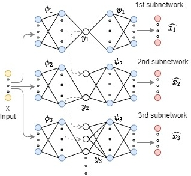
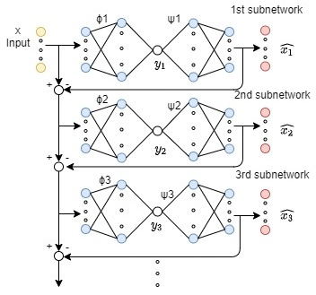
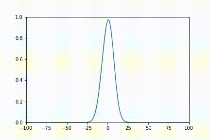
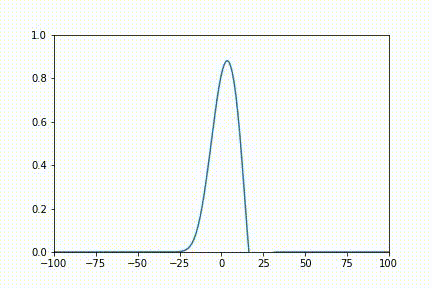
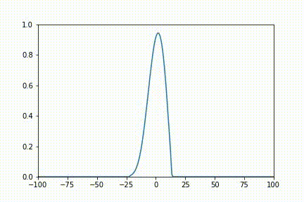
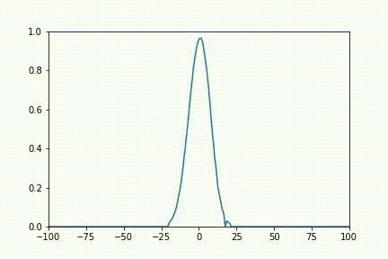
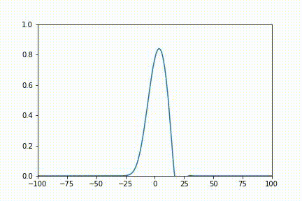
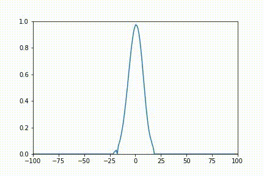

# acse-9-independent-research-project-fy120

## A comparison of dimensionality reduction methods for fluid flow problems focusing on hierarchical autoencoders

 

  <a href="https://github.com/acse-fy120/acse-9-independent-research-project-fy120/blob/main/pics/POD architecture.jpg">
    
    <figcaption> Achitechture of principal component analysis</figcaption>
  </a>

  <a href="https://github.com/acse-fy120/acse-9-independent-research-project-fy120/blob/main/pics/FCAE architecture.jpg">
    
    <figcaption> Achitechture of fully-connected autoencoder </figcaption>
  </a>

  <a href="https://github.com/acse-fy120/acse-9-independent-research-project-fy120/blob/main/pics/SFCCAE architecture.jpg">
    
    <figcaption> Achitechture of space-filling-curve convolutional autoencoder </figcaption>
  </a>

  <a href="https://github.com/acse-fy120/acse-9-independent-research-project-fy120/blob/main/pics/HAE.jpg">
    
    <figcaption> Achitechture of hierarchical autoencoder </figcaption>
  </a>

  <a href="https://github.com/acse-fy120/acse-9-independent-research-project-fy120/blob/main/pics/SAE.jpg">
    
    <figcaption> Achitechture of sequential autoencoder </figcaption>
  </a>

  
Table of Contents

  <ol>
    <li>
      <a href="#project-description">Project Description</a>
    </li>
    <li>
      <a href="#getting-started">Getting Started</a>
      <ul>
        <li><a href="#download">Download</a></li>
        <li><a href="#directory-tree">Directory tree</a></li>
      </ul>
    </li>
    <li><a href="#Template-Notebooks">Colab Notebooks</a>
      <ul>
        <li><a href="#Burgers-equation">Burgers equation</a></li>
        <li>
            <a href="#Flow-past-cylinder">Flow past cylinder</a>
            <ul>
              <li><a href="#FPC-SFC-CAE">SFC-CAE</a></li>
              li><a href="#FPC-SFC-HAE">SFC-HAE </a></li>
              <li><a href="#FPC-SFC-CAE">SFC-SAE</a></li>
              <li><a href="#FPC-SVD-AE">SVD-AE</a></li>
              <li><a href="#FPC-SFC-POD">POD</a></li>
            </ul>
        </li>
      </ul>   
    </li>
    <li><a href="#License">License</a></li>
    <li><a href="#Testing">Testing</a></li>
    <li><a href="#Contact">Contact</a></li>
    <li><a href="#Acknowledgements">Acknowledgements</a></li>
  </ol>

<!-- copy_over_N_files.py在压缩包中需要删除 -->
## Project Description
To investigate the application of the dimensionality reduction methods in fluid dynamics, this project implements and compares many dimensionality reduction methods including proper orthogonal decomposition(POD), fully-connected autoencoder (FC-AE), convolutional autoencoder (CAE), space-filling curve - convolutional autoencoder (SFC-CAE), hierarchical autoencoder (HAE) and sequential autoencoder (SAE). Moreover, the novel space-filling curve-hierarchical autoencoder (SFC-HAE) is proposed. The mentioned methods are assessed with two fluid solutions, namely: (1) burgers equation, (2) flow past cylinder, in terms of mean square error (MSE) and computation time. 
The project is based on the wokr of previous year https://arxiv.org/abs/2011.14820,https://github.com/ImperialCollegeLondon/SFC-CAE and paper https://arxiv.org/abs/2006.06977.

## Getting Started
### Download

### Directory tree

#### Directory tree in Colab

#### Directory tree in local computer

## Template Notebooks
### Burgers equation

  

     
     <a href="pics/original_BE.gif"><strong>Original Burgers equation</strong></a>
     
     <a href="pics/POD_BE_2variable.gif"><strong>Burgers equation POD 2 variables</strong></a>
     
     <a href="pics/FCAE_BE_2variable.gif"><strong>Burgers equation FC-AE 2 variables</strong></a>
     
     <a href="pics/CAE_BE_2variable.gif"><strong>Burgers equation CAE 2 variables</strong></a>
     
     <a href="pics/SVDAE_BE_2variable.gif"><strong>Burgers equation SVD-AE 2 variables</strong></a>
     
     <a href="pics/HAE_BE_2variable.gif"><strong>Burgers equation HAE 2 variables</strong></a>
  

### FPC

  

     
     <a href="pics/Fpc-Orginal.gif"><strong>Original FPC</strong></a>
  

#### SFC-CAE

  

     
     <a href="pics/FPC_SFC_CAE_64.gif"><strong>FPC SFC-CAE 64 variables</strong></a>
  

#### SFC-HAE

  

     
     <a href="pics/Fpc-Hae_64.gif"><strong>FPC SFC-HAE 64 variables</strong></a>
  

#### SFC-SAE

  

     
     <a href="pics/Fpc-Sae_64.gif"><strong>FPC SFC-SAE 64 variables</strong></a>
  

#### SVD-AE

  

     
     <a href="pics/FPC-SVDAE_64.gif"><strong>FPC SVD-AE 64 variables</strong><a>
  

#### POD

  

     
     <a href="pics/Fpc-Pod_64.gif"><strong>FPC POD 64 variables</strong><a>
  

